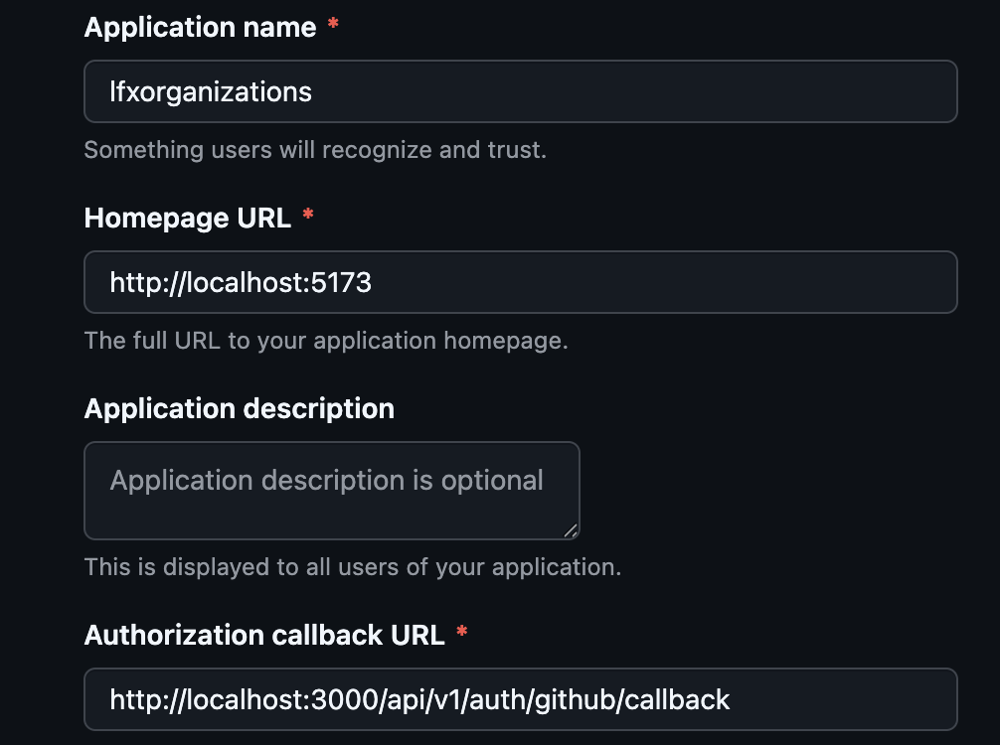

# LFX Organizations Dashboard

A simple dashboard to view and past records of organizations that have participated in LFX programs. This project helps contributors discover organizations, inspect historical participation, and decide where to contribute.

## Requirements

- **Node.js**: 22.x (required)
- **Docker**: latest stable
- **Docker Compose**: latest stable

## Quick Start — Local Setup

1. **Fork the repository on GitHub**, then clone your fork locally:
    ```bash
    cd lfxorganizations
    ```

2. **Terminal 1** — set backend environment:
    ```bash
    cd service
    cp .env.example .env
    ```

3. **Terminal 2** — set UI environment:
    ```bash
    cd ui
    cp .env.example .env
    ```

4. **Create a GitHub OAuth app** with the configs shown in the image below:
     
   Get `CLIENT_SECRET` and `CLIENT_ID` for your app and fill values in both UI and service environment.

5. **OpenTelemetry and Signoz (optional)**:  
   Login to the Signoz platform and get the following variables:
   - `SIGNOZ_REGION`
   - `SIGNOZ_INGESTION_KEY`  
   Fill values in UI and backend environments.

   **Note**: If you don't want to use OpenTelemetry and Signoz, comment line 1 in `main.tsx` (UI) and `index.ts` (for root), and replace line 7 in `package.json` (service) with:
   ```json
   "dev": "node ts-node-dev --respawn --transpile-only src/index.ts",
   ```

6. **Terminal 3** — start backend (run from project root):
    ```bash
    docker compose build --no-cache
    docker compose up
    ```
   Wait until you see `Server running successfully` in the logs before proceeding.

7. **In Terminal 2** — start UI:
    ```bash
    npm i
    npm run dev
    ```
   Open the URL shown by the frontend dev server (typically http://localhost:5173).

## Data and Contributions

- Data files live in `service/data/*.json`. To fix inconsistencies or add records, edit the relevant JSON file and submit a PR.
- UI improvements, bug fixes, accessibility, and responsive design changes are welcome.

### When raising a PR:
- Fork the repo, create a branch (e.g., `feature/brief-description` or `fix/issue-number`).
- Commit with clear messages.
- Push the branch and open a Pull Request against the main repository.
- In the PR description, include what changed, why, and any testing steps.

**Example workflow**:
```bash
git checkout -b feature/your-feature
# make changes
git add .
git commit -m "feat: short description"
git push origin feature/your-feature
# open PR on GitHub
```

## Contribution Guidelines

- Edit JSON records under `data/` to update organization data.
- For UI changes, modify files under `ui/src/` and test with `npm run dev`.
- Provide reproducible steps for bugs and include screenshots or logs when helpful.
- Follow semantic commit messages and descriptive PR titles.

## Notes

- Ensure Node version 22.x is used for the frontend.
- Run backend first (Terminal 1) and only start the frontend (Terminal 2) after the backend reports `Server running successfully`.

Open a Pull Request on the main repository with:

- **Repo URL used for cloning**: [https://github.com/yashgoyal0110/lfxorganizations](https://github.com/yashgoyal0110/lfxorganizations)  
  Clear title describing the change.

Thank you for contributing — your improvements make the dashboard more useful for the community.